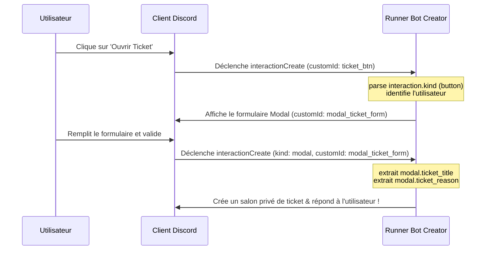

Les composants interactifs de Discord—**Boutons**, **Menus de Sélection** et **Modales** (formulaires popups)—transforment radicalement l'expérience utilisateur de votre bot. Au lieu de taper de longs arguments de commande, vos utilisateurs peuvent cliquer sur des boutons, choisir des rôles dans des menus déroulants ou remplir des formulaires structurés.

Dans ce guide, nous allons détailler exactement comment **Bot Creator** traite l'événement `interactionCreate` en arrière-plan et comment exploiter ses variables d'exécution natives dans vos scripts BDFD.

---

## 1. Les Variables d'Interaction Fondamentales

Chaque fois qu'un utilisateur interagit avec un composant, le runner Bot Creator distribue un contexte d'événement `interactionCreate`. Les variables globales suivantes sont systématiquement résolues :

| Variable | Type | Description |
| --- | --- | --- |
| `((interaction.kind))` | string | Le type d'interaction : `button`, `select`, `modal`, `command` ou `autocomplete`. |
| `((interaction.customId))` | string | L'identifiant unique (défini par vous) lié à l'élément cliqué ou soumis. |
| `((interaction.userId))` | string | L'identifiant Discord de l'utilisateur qui a déclenché l'interaction. |
| `((interaction.channelId))` | string | L'identifiant du salon où l'interaction s'est produite. |
| `((interaction.guildId))` | string | L'identifiant du serveur Discord concerné. |
| `((interaction.messageId))` | string | L'identifiant du message contenant le bouton ou le menu déroulant. |

> [!NOTE]
> Les variables de contexte de membre telles que `((member.nick))`, `((member.joinedAt))` et `((member.roles))` sont automatiquement enrichies et disponibles dès que l'interaction a lieu sur un serveur de guilde !

---

## 2. Gérer les Clics de Boutons

Les boutons sont le moyen le plus simple d'ajouter des actions directes en un clic. En BDFD, lors de la création d'un bouton, vous lui attribuez un **Custom ID** (par exemple `button_verify` ou `button_ticket`).

Lorsqu'il est cliqué, le runner déclenche l'événement `interactionCreate`. Vous pouvez facilement orienter les flux d'exécution à l'aide d'une condition simple :

```bdfd
$if[((interaction.customId))==button_verify]
  $sendResponse[Votre compte a été vérifié avec succès ! // ephemeral]
  $giveRole[((interaction.userId));112233445566778899]
$endif
```

> [!TIP]
> Vérifiez toujours que `((interaction.kind))` est égal à `button` si vous utilisez des identifiants personnalisés similaires entre les boutons et les listes déroulantes pour éviter des chevauchements de code.

---

## 3. Traiter les Menus Déroulants (Select Menus)

Les menus de sélection permettent aux utilisateurs de choisir une ou plusieurs options dans une liste. Bot Creator prend en charge cinq formats de menus déroulants et parse automatiquement les choix dans des collections lisibles :

### A. String Selects (Options de Texte Custom)
Pour les menus où les choix sont des valeurs de texte personnalisées (ex: choisir une catégorie de commandes).
*   `((interaction.stringSelect.value))` — Retourne le premier choix sélectionné.
*   `((interaction.stringSelect.values))` — Retourne une liste séparée par des virgules de toutes les options choisies (pour le multi-sélection).
*   `((interaction.stringSelect.count))` — Retourne le nombre total d'options choisies.

### B. User Selects (Sélection de Membres)
Pour les listes déroulantes peuplées dynamiquement avec les membres du serveur.
*   `((interaction.userSelect.userId))` — Retourne l'identifiant du premier utilisateur sélectionné.
*   `((interaction.userSelect.userIds))` — Retourne tous les identifiants d'utilisateurs sélectionnés.
*   `((interaction.userSelect.userCount))` — Retourne le nombre total d'utilisateurs choisis.

### C. Role Selects (Sélection de Rôles)
Pour les listes déroulantes peuplées dynamiquement avec les rôles du serveur.
*   `((interaction.roleSelect.roleId))` — Retourne l'identifiant du premier rôle sélectionné.
*   `((interaction.roleSelect.roleIds))` — Retourne tous les identifiants de rôles sélectionnés.
*   `((interaction.roleSelect.roleCount))` — Retourne le nombre total de rôles choisis.

### D. Channel Selects (Sélection de Salons)
Pour les salons textuels ou vocaux du serveur.
*   `((interaction.channelSelect.channelId))` — Retourne l'identifiant du premier salon sélectionné.
*   `((interaction.channelSelect.channelIds))` — Retourne tous les identifiants de salons sélectionnés.
*   `((interaction.channelSelect.channelCount))` — Retourne le nombre total de salons choisis.

### E. Mentionable Selects (Sélection de Mentionnables)
Pour les listes où l'utilisateur peut choisir indistinctement des rôles ou des utilisateurs.
*   `((interaction.mentionableSelect.userId))` — Retourne l'identifiant sélectionné.
*   `((interaction.mentionableSelect.userIds))` — Retourne tous les identifiants sélectionnés.
*   `((interaction.mentionableSelect.userCount))` — Retourne le nombre total choisi.

---

## 4. Récupérer les données des Formulaires Modaux (Modales)

Les modales affichent des formulaires popups. Lorsqu'une modale est soumise, le runner traite l'interaction avec le type `modal`.

Chaque champ de texte de la modale possède son propre Custom ID. Bot Creator mappe dynamiquement ces entrées dans la syntaxe `((modal.VOTRE_INPUT_CUSTOM_ID))` !

### Exemple de traitement de Modale

Si vous concevez une modale d'inscription avec :
1. Custom ID de la Modale : `user_registration_form`
2. Champ de texte 1 Custom ID : `user_realname`
3. Champ de texte 2 Custom ID : `user_description`

Lors de la soumission du formulaire, vous pouvez intercepter les réponses de l'utilisateur instantanément :

```bdfd
$if[((interaction.kind))==modal]
  $if[((modal.customId))==user_registration_form]
    $setVar[profile_name;((modal.user_realname));((interaction.userId))]
    $setVar[profile_desc;((modal.user_description));((interaction.userId))]
    
    $sendResponse[Profil configuré avec succès, ((user.username)) ! // ephemeral]
  $endif
$endif
```

> [!IMPORTANT]
> Les entrées des modales sont toujours traitées comme des chaînes de caractères (strings). Si vous attendez un nombre, utilisez `$parseInt` avant de réaliser des comparaisons mathématiques dans vos conditions.

---

## 5. Interactions d'Autocomplétion & Menus Contextuels

Au-delà des boutons et des formulaires modaux, Discord prend en charge deux autres systèmes d'interactions puissants : l'**Autocomplétion** et les **Menus Contextuels**. Bot Creator les expose nativement :

### Interactions d'Autocomplétion
Lorsqu'un utilisateur commence à taper une commande slash, votre bot peut proposer des choix de complétion dynamiques. Durant cette phase :
*   `((interaction.kind))` est égal à `autocomplete`.
*   Vous pouvez intercepter la saisie partielle et renvoyer instantanément des choix correspondants à l'aide de conditions BDFD personnalisées.

### Menus Contextuels Utilisateur & Message
Les menus contextuels permettent aux utilisateurs de faire un clic droit sur un membre ou un message pour exécuter une action applicative (ex: `Applications > Signaler Message` ou `Applications > Infos Utilisateur`).
*   `((interaction.command.type))` prend les valeurs suivantes :
    *   `1` — Chat Input (commande slash standard).
    *   `2` — Menu Contextuel Utilisateur (clic droit sur un profil).
    *   `3` — Menu Contextuel Message (clic droit sur une bulle de message).
*   `((interaction.command.name))` retourne le nom de l'option d'application choisie.
*   `((interaction.command.id))` retourne l'identifiant unique de la commande enregistrée.

---

## 6. Enrichissement Avancé du Profil Membre & Utilisateur

Lors de chaque interaction, Bot Creator enrichit automatiquement le contexte avec des attributs de haute précision sur l'utilisateur et le membre du serveur :

### Attributs du Membre du Serveur (`((member.*))`)
Disponibles dans les environnements de serveur de guilde :
*   `((member.isBooster))` — Retourne `true` ou `false` indiquant si le membre booste actuellement le serveur.
*   `((member.communicationDisabledUntil))` — Retourne la date/heure de fin d'exclusion (timeout) au format ISO8601 si l'utilisateur est exclu par la modération (vide sinon).
*   `((member.roles))` — Liste séparée par des virgules de tous les identifiants de rôles attribués.
*   `((member.roles.count))` — Le nombre total de rôles détenus par le membre.
*   `((member.avatar))` — L'URL au format webp de l'avatar spécifique du membre sur ce serveur (supporte les GIFs animés).

### Attributs Globaux de l'Utilisateur (`((user.*))` / `((author.*))`)
Configurations globales du compte :
*   `((user.banner))` — L'URL de l'image de bannière personnalisée du profil de l'utilisateur.
*   `((user.bannerColor))` — Le code couleur HEX de la bannière de profil (ex: `#ff00aa`).
*   `((user.createdAt))` — L'horodatage exact ISO8601 de la création du compte, calculé directement à partir de son identifiant Snowflake.

---

## 7. Architecture complète d'un flux interactif

Voici comment se déroule un cycle d'interaction complet dans Bot Creator :



Grâce à ce système natif à haute performance, vos intégrations de boutons et formulaires modaux restent fluides, extrêmement sécurisées et ne polluent jamais l'environnement d'exécution de vos commandes standards !
