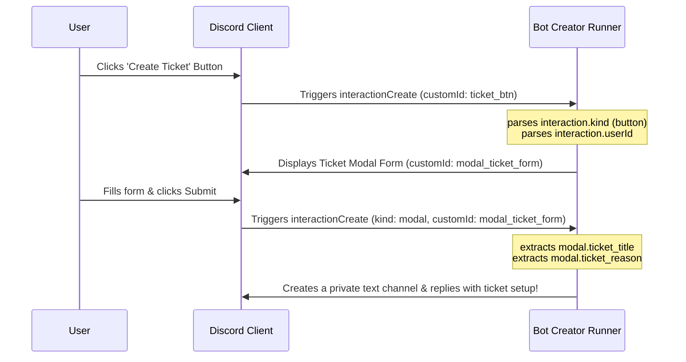

Discord's rich components—**Buttons**, **Select Menus**, and **Modals**—take your bot's user experience to a professional, commercial grade. Instead of typing long command arguments, users can tap buttons, choose roles from dropdown lists, or fill out structured pop-up forms.

In this guide, we will break down exactly how **Bot Creator** processes the `interactionCreate` event under the hood and how you can leverage its native runtime variables in your BDFD scripts.

---

## 1. The Core Interaction Variables

Whenever a user interacts with a component, the Bot Creator runner dispatches an `interactionCreate` context. The following global variables are always resolved:

| Variable | Type | Description |
| --- | --- | --- |
| `((interaction.kind))` | string | The type of interaction: `button`, `select`, `modal`, `command`, or `autocomplete`. |
| `((interaction.customId))` | string | The unique developer-defined identifier bound to the clicked element. |
| `((interaction.userId))` | string | The Discord ID of the user who triggered the interaction. |
| `((interaction.channelId))` | string | The ID of the channel where the interaction happened. |
| `((interaction.guildId))` | string | The ID of the server where the interaction happened. |
| `((interaction.messageId))` | string | The ID of the message holding the button or dropdown. |

> [!NOTE]
> Member context variables like `((member.nick))`, `((member.joinedAt))`, and `((member.roles))` are automatically enriched and available whenever the interaction occurs inside a guild server!

---

## 2. Handling Button Clicks

Buttons are the simplest way to add direct, click-to-trigger actions. In BDFD, when creating a button, you assign it a **Custom ID** (e.g. `button_verify` or `button_ticket`).

When clicked, the runner triggers the `interactionCreate` event. You can easily direct execution flows using a simple conditional structure:

```bdfd
$if[((interaction.customId))==button_verify]
  $sendResponse[Your account has been successfully verified! // ephemeral]
  $giveRole[((interaction.userId));112233445566778899]
$endif
```

> [!TIP]
> Always verify that `((interaction.kind))` equals `button` if you have overlapping custom IDs between buttons and dropdowns to prevent execution leakage.

---

## 3. Parsing Select Dropdown Menus

Select menus allow users to choose one or multiple items from a pre-configured list. Bot Creator supports five distinct select menu formats and automatically parses selected options into readable collections:

### A. String Selects (Text Options)
For dropdowns where the choices are custom text values (e.g. choosing a command category).
*   `((interaction.stringSelect.value))` — Returns the first selected choice.
*   `((interaction.stringSelect.values))` — Returns a comma-separated list of all chosen options (for multi-select).
*   `((interaction.stringSelect.count))` — Returns the total count of chosen options.

### B. User Selects
For dropdowns populated dynamically with guild members.
*   `((interaction.userSelect.userId))` — Returns the first selected user ID.
*   `((interaction.userSelect.userIds))` — Returns all selected user IDs.
*   `((interaction.userSelect.userCount))` — Returns the total count of chosen users.

### C. Role Selects
For dropdowns populated dynamically with server roles.
*   `((interaction.roleSelect.roleId))` — Returns the first selected role ID.
*   `((interaction.roleSelect.roleIds))` — Returns all selected role IDs.
*   `((interaction.roleSelect.roleCount))` — Returns the total count of chosen roles.

### D. Channel Selects
For dropdowns populated dynamically with server text/voice channels.
*   `((interaction.channelSelect.channelId))` — Returns the first selected channel ID.
*   `((interaction.channelSelect.channelIds))` — Returns all selected channel IDs.
*   `((interaction.channelSelect.channelCount))` — Returns the total count of chosen channels.

### E. Mentionable Selects
For dropdowns where users can select either users or roles.
*   `((interaction.mentionableSelect.userId))` — Returns the selected user or role ID.
*   `((interaction.mentionableSelect.userIds))` — Returns all selected IDs.
*   `((interaction.mentionableSelect.userCount))` — Returns the total count.

---

## 4. Processing Modal Form Submissions

Modals display popup form dialogs with text inputs. When a modal is submitted, the runner processes it with the kind set to `modal`.

Every input field in the modal must have a Custom ID. Bot Creator maps these inputs dynamically into the `((modal.YOUR_INPUT_CUSTOM_ID))` syntax!

### Modal Parsing Example

If you build a registration modal with:
1. Modal Custom ID: `user_registration_form`
2. Text Input 1 Custom ID: `user_realname`
3. Text Input 2 Custom ID: `user_description`

When the user submits the form, you can fetch and store their answers instantly inside the `interactionCreate` handler:

```bdfd
$if[((interaction.kind))==modal]
  $if[((modal.customId))==user_registration_form]
    $setVar[profile_name;((modal.user_realname));((interaction.userId))]
    $setVar[profile_desc;((modal.user_description));((interaction.userId))]
    
    $sendResponse[Profile successfully configured, ((user.username))! // ephemeral]
  $endif
$endif
```

> [!IMPORTANT]
> Modal inputs are always processed as strings. If you expect a number, use standard parsing tools like `$parseInt` before executing mathematical comparisons inside your conditions.

---

## 5. Full Interactive Flow Architecture

Here is how a complete interaction cycle looks in Bot Creator:

## 5. Autocomplete & Context Menu Interactions

Beyond buttons and modals, Discord supports two other powerful interaction systems: **Autocomplete** and **Context Menus**. Bot Creator exposes these natively:

### Autocomplete Interactions
When a user begins typing a slash command, your bot can provide dynamic completion choices. During this phase:
*   `((interaction.kind))` resolves to `autocomplete`.
*   You can intercept the partial input and use custom BDFD logic to return instantaneous matching choices.

### User & Message Context Menus
Context menus allow users to right-click a user or message and execute an application action (e.g., `Apps > Report Message` or `Apps > User Info`).
*   `((interaction.command.type))` resolves to:
    *   `1` — Chat Input (standard slash command).
    *   `2` — User Context Menu (right-clicking a user profile).
    *   `3` — Message Context Menu (right-clicking a message bubble).
*   `((interaction.command.name))` returns the name of the Apps option chosen.
*   `((interaction.command.id))` returns the unique ID of the registered command.

---

## 6. Advanced Member & User Profile Enrichment

Whenever an interaction occurs, Bot Creator automatically enriches the context with high-fidelity attributes of the acting user and guild member:

### Guild Member Attributes (`((member.*))`)
Available inside server environments:
*   `((member.isBooster))` — Returns `true` or `false` indicating if the user is boosting the current server.
*   `((member.communicationDisabledUntil))` — Returns the ISO8601 timeout date/time if the member is currently timed out by moderators (empty otherwise).
*   `((member.roles))` — Comma-separated list of all role IDs assigned to the member.
*   `((member.roles.count))` — The number of roles the member holds.
*   `((member.avatar))` — Resolved webp member-specific avatar URL (supports animated GIFs).

### Global User Profile Attributes (`((user.*))` / `((author.*))`)
Global user configurations:
*   `((user.banner))` — URL of the user's custom profile banner image.
*   `((user.bannerColor))` — HEX color code of the profile banner (e.g. `#ff00aa`).
*   `((user.createdAt))` — Exact ISO8601 timestamp of when the user account was created, calculated directly from the Snowflake ID.

---

## 7. Full Interactive Flow Architecture

Here is how a complete interaction cycle looks in Bot Creator:



By leveraging this native, high-performance runtime system, your Bot Creator integrations remain lightning-fast and highly secure, without ever leaking variables into parent contexts!
