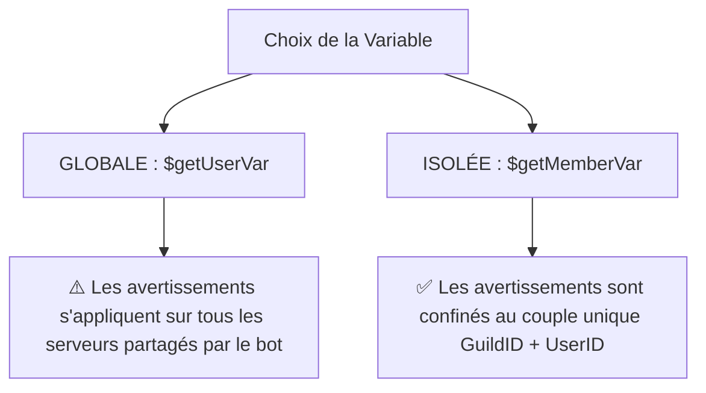

Un **système d'avertissements (Warn System)** robuste est la pierre angulaire de tout bot de modération Discord professionnel. Il permet à l'équipe de modération de donner des avertissements formels aux membres enfreignant le règlement, de suivre leur historique, et de prendre des mesures disciplinaires progressives.

Lors de la conception d'un tel système, le principal piège à éviter est la fuite de données : si vous utilisez des variables utilisateur classiques (`$getUserVar`), un membre averti sur le **Serveur A** conservera ses avertissements sur le **Serveur B**.

Pour éviter cela, nous devons utiliser les **variables membres isolées** (`$getMemberVar` / `$setMemberVar`), cloisonnant les données à chaque serveur. Dans ce guide, nous allons concevoir un système de warns complet, sécurisé et professionnel !

---

## 🗄️ Portée des Données : Éviter les Fuites Inter-Serveurs

Sous le capot de Bot Creator / BDFD, la portée des variables est cruciale. Pour garantir la sécurité de votre outil :



En choisissant `$getMemberVar[warns;userID;guildID]`, les données de vos serveurs restent étanches et strictement confinées !

---

## 0. Prérequis : Enregistrer la Variable dans le Panel

Avant de coder vos commandes, déclarez votre variable d'avertissement dans le tableau de bord Bot Creator :
* **Nom** : `warns`
* **Valeur par Défaut** : `0`

---

## 1. La Commande d'Avertissement (`!warn`)

Donne un avertissement à un membre, incrémente son compteur d'infractions, enregistre le motif, et lui envoie une notification privée par DM.

* **Déclencheur (Trigger)** : `!warn` ou `warn` (compatible commandes slash)
* **Code** :

```bdfd
$nomention
$onlyPerms[kickmembers;❌ Vous devez disposer de la permission d'exclure des membres pour donner un avertissement !]

$var[cible;$findUser[$message;no]]

$if[$var[cible]==]
  ❌ Veuillez spécifier un membre valide !
  Exemple : `!warn @pseudo <raison>`
$else
  $if[$var[cible]==$authorID]
    ❌ Vous ne pouvez pas vous avertir vous-même !
  $else
    $var[raison;$noMentionMessage]
    $if[$var[raison]==]
      $var[raison;Aucun motif fourni par le modérateur.]
    $endif

    // Lecture, incrémentation et écriture en base de données
    $var[warnsActuels;$getMemberVar[warns;$var[cible];$guildID]]
    $var[nouveauxWarns;$calculate[$var[warnsActuels] + 1]]
    $setMemberVar[warns;$var[nouveauxWarns];$var[cible];$guildID]

    // Notification privée par DM à la cible
    $dm[$var[cible]]
    $title[⚠️ Avis d'Infraction]
    $color[#ef4444]
    $description[
    Vous avez reçu un avertissement formel sur le serveur **$serverName**.
    * **Raison** : $var[raison]
    * **Total des avertissements** : `$var[nouveauxWarns]`
    ]
    $sendDM

    // Confirmation publique de la modération dans le salon
    $clear
    $title[🔨 Avertissement Enregistré]
    $color[#ef4444]
    $thumbnail[$userAvatar[$var[cible]]]
    $description[
    **$username[$var[cible]]** a été averti avec succès.
    ]
    $addField[ID Infraction;`#$random[1000;9999]`;true]
    $addField[Total Warns;`$var[nouveauxWarns]` avertissements;true]
    $addField[Raison;$var[raison];false]
    $footer[Modérateur : $username; $authorAvatar]
    $addTimestamp
  $endif
$endif
```

---

## 2. Consulter les Avertissements (`!warns`)

Affiche le total des avertissements d'un membre sur le serveur actuel.

* **Déclencheur (Trigger)** : `!warns`
* **Code** :

```bdfd
$nomention
$var[cible;$findUser[$message;yes]]

$var[infractions;$getMemberVar[warns;$var[cible];$guildID]]

$title[🗃️ Casier de Modération]
$color[#3b82f6]
$thumbnail[$userAvatar[$var[cible]]]

$description[
Historique d'avertissements de **$username[$var[cible]]** sur ce serveur :

* **Avertissements actifs** : `$var[infractions]` avertissements formels
]

$if[$var[infractions]>=3]
  $description[$description[]⚠️ **Alerte** : Ce membre cumule 3 avertissements ou plus ! Pensez à appliquer des sanctions plus sévères.]
$endif

$footer[Consulté par $username; $authorAvatar]
$addTimestamp
```

---

## 3. Retirer un Avertissement (`!unwarn`)

Diminue de `1` le compteur d'avertissements d'un membre. Pratique pour corriger une erreur.

* **Déclencheur (Trigger)** : `!unwarn`
* **Code** :

```bdfd
$nomention
$onlyPerms[kickmembers;❌ Vous devez disposer de la permission d'exclure des membres pour annuler un avertissement !]

$var[cible;$findUser[$message;no]]

$if[$var[cible]==]
  ❌ Veuillez spécifier un membre valide ! Exemple : `!unwarn @pseudo`
$else
  $var[warnsActuels;$getMemberVar[warns;$var[cible];$guildID]]

  $if[$var[warnsActuels]<=0]
    ❌ **$username[$var[cible]]** ne possède aucun avertissement actif à retirer !
  $else
    $var[nouveauxWarns;$calculate[$var[warnsActuels] - 1]]
    $setMemberVar[warns;$var[nouveauxWarns];$var[cible];$guildID]

    $title[✅ Avertissement Annulé]
    $color[#10b981]
    $description[
    Un avertissement a été retiré avec succès à **$username[$var[cible]]**.
    * **Avertissements précédents** : `$var[warnsActuels]`
    * **Nouveau total d'avertissements** : `$var[nouveauxWarns]`
    ]
    $footer[Action effectuée par : $username; $authorAvatar]
    $addTimestamp
  $endif
$endif
```

---

## 4. Réinitialiser les Avertissements (`!clearwarns`)

Efface complètement l'historique d'infractions d'un membre, remettant son compteur à `0`.

* **Déclencheur (Trigger)** : `!clearwarns`
* **Code** :

```bdfd
$nomention
$onlyPerms[banmembers;❌ Seuls les modérateurs habilités à bannir peuvent effacer le casier des avertissements !]

$var[cible;$findUser[$message;no]]

$if[$var[cible]==]
  ❌ Veuillez spécifier un membre ! Exemple : `!clearwarns @pseudo`
$else
  $var[warnsActuels;$getMemberVar[warns;$var[cible];$guildID]]

  $if[$var[warnsActuels]<=0]
    ❌ Le casier de **$username[$var[cible]]** est déjà parfaitement vierge !
  $else
    // Réinitialisation de la variable membre
    $resetMemberVar[warns;$var[cible];$guildID]

    $title[🧹 Historique de Modération Effacé]
    $color[#6366f1]
    $description[
    Le casier d'avertissements de **$username[$var[cible]]** a été entièrement réinitialisé.
    * **Avertissements supprimés** : `$var[warnsActuels]`
    * **Statut actuel** : `0` avertissements (Dossier Vierge)
    ]
    $footer[Effacé par : $username; $authorAvatar]
    $addTimestamp
  $endif
$endif
```
---
