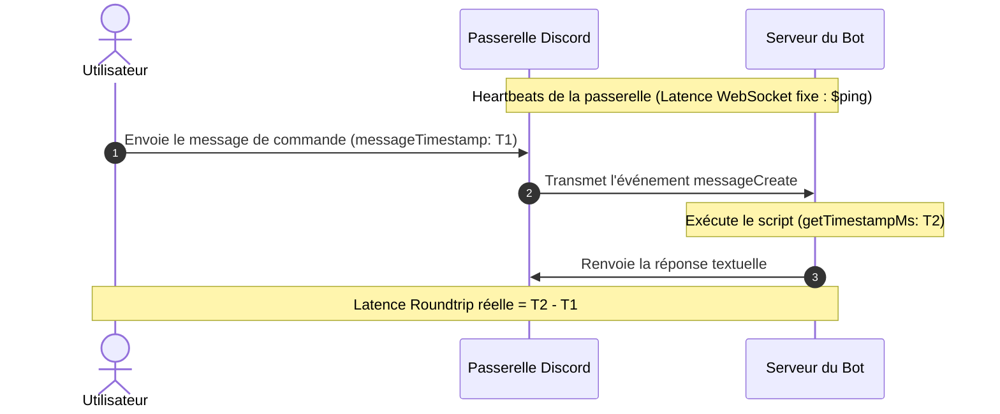

La commande `ping` est le grand classique incontournable de tout bot Discord. Bien qu'elle paraisse simple en apparence, saviez-vous qu'un bot Discord possède en réalité plusieurs types de latence ?

La plupart des guides basiques se contentent d'afficher la latence de connexion brute. Pourtant, un bot professionnel se doit de fournir un diagnostic précis, séparant la vitesse de connexion interne (passerelle/WebSocket) du temps réel de traitement des messages ressenti par les utilisateurs.

Ce guide vous explique pas à pas comment concevoir la commande `/ping` (ou `!ping`) ultime avec Bot Designer for Discord (BDFD) / Bot Creator.

---

## 📊 Les Deux Types de Latence Expliqués

Pour évaluer précisément les performances de votre bot Discord, vous devez analyser deux mesures distinctes :

| Métrique | Ce qu'elle mesure | Fonction / Formule BDFD |
| :--- | :--- | :--- |
| **Latence Passerelle / WebSocket** | La vitesse de connexion "battement de cœur" (heartbeat) entre le serveur d'exécution de votre bot et la passerelle Discord. | `$ping` (ou `((bot.ping))`) |
| **Temps de Réponse Global (Roundtrip)** | Le temps total écoulé entre le moment où l'utilisateur envoie son message, le traitement par le bot, et l'affichage de la réponse. | `$calculate[$getTimestampMs - $messageTimestamp]` |

---

## 1. La Latence de la Passerelle (`$ping`)

La fonction native `$ping` (également accessible via les variables de modèles de Bot Creator sous `((bot.ping))` ou `((ping))`) renvoie la **latence du signal heartbeat WebSocket** en millisecondes. Elle est calculée automatiquement par le moteur d'exécution de votre bot.

### Syntaxe
```bdfd
$ping
```

* **Résultat** : Retourne directement la valeur numérique de la latence (par exemple, `42`), représentant le délai en millisecondes.

---

## 2. Le Temps de Réponse Réel (Roundtrip)

Pour calculer le temps de traitement global perçu par l'utilisateur final, nous soustrayons le moment où le message de commande a été envoyé de l'instant précis où le script est exécuté par le bot.

Bot Creator fournit deux variables de haute précision pour effectuer cette opération mathématique :
1. `$getTimestampMs` (l'horodatage système actuel en millisecondes).
2. `$messageTimestamp` (l'horodatage d'envoi du message en millisecondes).

En insérant ces variables dans la fonction `$calculate`, vous obtenez un temps de latence réel et dynamique :

### Formule
```bdfd
$calculate[$getTimestampMs - $messageTimestamp]
```

* **Résultat** : Le nombre exact de millisecondes qui se sont écoulées entre l'envoi de la commande par l'utilisateur et sa prise en charge par le processus d'exécution de votre bot.

---

## 3. Flux Visuel du Calcul de Latence

Voici comment ces deux latences sont calculées et perçues en arrière-plan :



---

## 4. Le Script de Production Complet

Voici un modèle de code BDFD extrêmement soigné, esthétique et prêt à l'emploi. Il intègre une structure d'embed moderne, épurée et réactive qui adapte sa couleur selon la rapidité des temps de réponse !

### Configuration de la commande
* **Déclencheur (Trigger)** : `ping` ou `!ping` (ou configuré comme Commande Slash)
* **Code** :

```bdfd
$title[🏓 Pong!]
$color[#3b82f6]
$thumbnail[$userAvatar[$botID]]

$description[
📊 **Diagnostic de la Latence**
Voici les détails actuels sur la réactivité de notre système :
]

$addField[Ping WebSocket;⚡ `$ping ms` (Signal Heartbeat);true]
$addField[API Roundtrip;⌛ `$calculate[$getTimestampMs - $messageTimestamp] ms` (Traitement réel);true]

$footer[Demandé par $username; $authorAvatar]
$addTimestamp
```

### Astuce de Pro : Indicateurs de Couleurs Dynamiques
Pour aller encore plus loin, vous pouvez modifier dynamiquement la couleur de l'embed et le message d'analyse selon l'état des connexions avec des blocs `$if` :

```bdfd
$var[roundtrip;$calculate[$getTimestampMs - $messageTimestamp]]

$title[🏓 Pong!]
$thumbnail[$userAvatar[$botID]]

$description[
📊 **Rapport de Diagnostic Système**
]

$addField[Latence WebSocket;⚡ `$ping ms`;true]
$addField[Latence API;⌛ `$var[roundtrip] ms`;true]

$if[$var[roundtrip]<150]
  $color[#10b981]  // Vert : Latence excellente
  $description[$description[]🟢 La qualité de connexion est **excellente** !]
$else
  $if[$var[roundtrip]<300]
    $color[#f59e0b]  // Jaune / Orange : Latence moyenne
    $description[$description[]🟡 La connexion est stable, mais subit un léger ralentissement.]
  $else
    $color[#ef4444]  // Rouge : Latence élevée
    $description[$description[]🔴 Ralentissement important détecté. Discord ou le serveur d'hébergement est probablement surchargé.]
  $endif
$endif

$footer[Diagnostics terminés; $authorAvatar]
$addTimestamp
```

---

## 🛠️ Résolution des Problèmes & Bonnes Pratiques

* **Utilisez impérativement `$getTimestampMs`** : Évitez la fonction `$getTimestamp` classique car elle renvoie les données en secondes, rendant impossible la soustraction en millisecondes.
* **Compatibilité des commandes slash** : Si vous utilisez des commandes slash enrichies, `$messageTimestamp` reste pleinement fonctionnel grâce à l'injection automatique du contexte d'interaction par le runner Bot Creator.
* **Valeurs négatives ?** : Dans de rares cas (désynchronisation mineure des horloges serveurs ou traitement asynchrone ultra-rapide), le calcul peut donner un nombre légèrement négatif. Gérer ce cas en ramenant le score à `0 ms` via une simple condition de garde est une excellente pratique.
