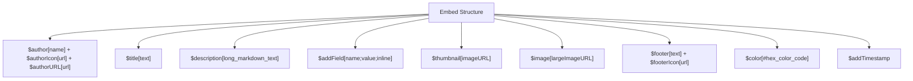

Standard text messages are fine for basic conversation, but they lack structure. If you want your Discord bot to look premium, professional, and readable, you must master **Embeds**. Embeds are specially formatted cards that support custom colors, images, titles, fields, footers, and metadata.

In this guide, we will explore the complete BDFD/Bot Creator embed styling toolset and learn how to build gorgeous, highly optimized layouts for your commands.

---

## 🎨 Anatomy of a Discord Embed

A standard Discord embed consists of several distinct blocks. BDFD maps each block to a dedicated, intuitive function:



> [!NOTE]
> Every embed function takes an optional **last argument: the embed index** (from `1` to `10`, default `1`). `0` or `11` is an error ("Embed index must be between 1 and 10."). That is how you build several embeds in one message, e.g. `$title[Second embed;2]`. In particular the second argument of `$footer` and `$author` is the embed index, not an icon URL: use `$footerIcon` and `$authorIcon` for icons.

---

## 1. Setting the Foundation (Title, Description, and Color)

Every great embed starts with a clean title and description. You can also specify an accent color to give your command a consistent theme:

* **`$title[text;(index)]`**: Sets the bold header of your embed (at most 256 characters).
* **`$description[text;(index)]`**: The main body of your embed (at most 4096 characters). Supports standard Discord Markdown (bold, lists, codeblocks, custom emojis).
* **`$color[color;(index)]`**: Specifies the vertical accent bar color on the left. Write a hexadecimal code **starting with `#`** (e.g. `#3b82f6`). Without the `#`, the value is read as a decimal number, so `3b82f6` is ignored and no color is applied.

The text of one message's embeds (titles, descriptions, author names, footers, field names and values) cannot exceed 6000 characters in total.

### Code Example: Core Embed
```bdfd
$nomention
$title[📖 Server Rules]
$color[#f59e0b]
$description[
Welcome to our community! Please follow these guidelines:

1. **Be Respectful**: Treat everyone with kindness.
2. **No Spamming**: Keep channels clean and readable.
3. **Use Common Sense**: Have fun and stay safe!
]
```

---

## 2. Using Fields for Structured Data (`$addField`)

Fields are perfect for displaying key-value data (like catalog lists, user stats, or system diagnostics). By setting the third parameter to `yes` (or `true`), fields will align horizontally **in-line**:

```bdfd
$addField[name;value;(inline);(index)]
```
* **`name`**: The bold header of the field column (required, at most 256 characters).
* **`value`**: The text content within the column (required, at most 1024 characters).
* **`inline`**: (Optional, default `no`.) Set to `yes` or `true` to align fields side-by-side (up to 3 per row on desktop). Set to `no` or `false` to display the field on its own line. Any other value is an error.
* **`index`**: (Optional, 1 to 10, default `1`.) The embed that receives the field, not a position among the fields. An embed holds at most 25 fields.

### Code Example: In-line Fields
```bdfd
$nomention
$title[📊 Server Diagnostics]
$color[#10b981]

$addField[CPU Usage;🟢 `12%` / Standard Load;yes]
$addField[RAM Usage;🟡 `64%` / Stable;true]
$addField[Uptime;⚡ `3d 12h 4m`;true]
```

---

## 3. Adding Imagery (`$thumbnail` and `$image`)

Images bring your commands to life. You can add two types of images to any embed:

* **`$thumbnail[url;(index)]`**: Places a small image in the top-right corner. Perfect for displaying avatars, guild icons, or system status badges.
* **`$image[url;(index)]`**: Renders a large, full-width image at the bottom of the embed card. Best used for displaying banners, graphs, or welcome cards.

> [!TIP]
> Use direct links to image files so that Discord can render them.

---

## 4. Footers, Authors, and Timestamps

Adding metadata blocks gives your cards a complete, professional feel:

* **`$author[name;(index)]`**: Places a small profile block above the title (name at most 256 characters). Add its icon with **`$authorIcon[url;(index)]`** and a link with **`$authorURL[url;(index)]`**. The author block is only shown if it has a name.
* **`$footer[text;(index)]`**: Renders small gray text at the bottom (at most 2048 characters). Add its icon with **`$footerIcon[url;(index)]`**. The footer is only shown if it has a text.
* **`$addTimestamp[(index)]`**: Sets the embed timestamp to the current date and time, showing when the embed was generated.

---

## 🏆 The Ultimate Showcase: Server Info Command

Below is a complete, production-ready `!serverinfo` command that integrates most of the layout features we've discussed:

```bdfd
$nomention
$title[🏰 Server Information: $serverName]
$color[#6366f1]
$thumbnail[$serverIcon]

$author[System Analytics]
$authorIcon[$userAvatar[$botID]]

$description[
Detailed metrics and statistical overview for **$serverName**.
]

$addField[👑 Server Owner;<@$serverOwner>;yes]
$addField[👥 Total Members;`$membersCount` members;yes]
$addField[💬 Channels;`$channelCount` channels;yes]

$addField[🎭 Total Roles;`$roleCount` roles;yes]
$addField[⚡ Boost Tier;Tier `$boostLevel` (`$boostCount` boosts);yes]

$footer[Requested by $username]
$footerIcon[$authorAvatar]
$addTimestamp
```
