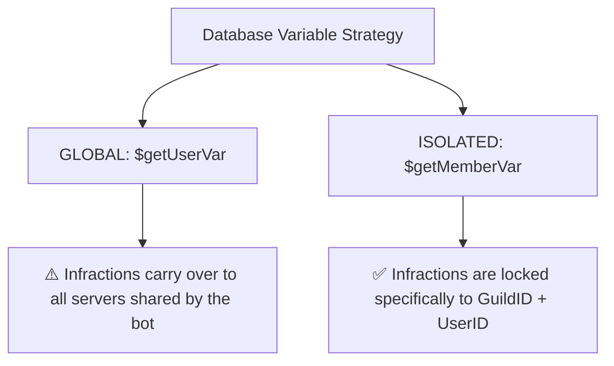

A robust **Warning (Warn) System** is a cornerstone of any professional Discord moderation bot. It allows server staff to issue formal warnings to misbehaving members, track their infractions, and take escalating disciplinary actions.

When building a warn system, one massive pitfall is database leakage: if you use standard user variables (`$getUserVar`), a user warned on **Server A** will carry those warnings over to **Server B**. 

To prevent this, we must leverage **Member-scoped variables** (`$getMemberVar` / `$setMemberVar`), isolating data to each server context. In this guide, we will build a complete, highly secure, and professional warn suite!

---

## 🗄️ Database Scope: Preventing Cross-Server Leakage

Under the hood of Bot Creator / BDFD, variables behave differently based on their database mapping. To build a secure moderation suite:



By utilizing `$getMemberVar[infractions;userID;guildID]`, user data remains secure and isolated.

---

## 0. Prerequisite: Register the Database Variable

Before coding your scripts, register the warning variable in your Bot Creator dashboard:
* **Name**: `warns`
* **Default Value**: `0`

---

## 1. The Warn Command (`!warn`)

Issues a warning to a member, increments their infraction counter, logs the reason, and sends a DM notification to the warned user.

* **Trigger**: `!warn` or `warn` (Slash command compatible)
* **Code**:

```bdfd
$nomention
$onlyPerms[kickmembers;❌ You need the `Kick Members` permission to warn users!]

$var[target;$findMember[$message;no]]

$if[$var[target]==]
  ❌ Please specify a valid member to warn! 
  Usage: `!warn @user <reason>`
$else
  $if[$var[target]==$authorID]
    ❌ You cannot warn yourself!
  $else
    $var[reason;$noMentionMessage]
    $if[$var[reason]==]
      $var[reason;No reason provided by staff.]
    $endif

    // Retrieve, increment, and write back the infractions counter
    $var[currentWarns;$getMemberVar[warns;$var[target];$guildID]]
    $var[newWarns;$calculate[$var[currentWarns] + 1]]
    $setMemberVar[warns;$var[newWarns];$var[target];$guildID]

    // Send a DM notification to the warned user
    $dm[$var[target]]
    $title[⚠️ Infraction Notice]
    $color[#ef4444]
    $description[
    You have received a formal warning in **$serverName**.
    * **Reason**: $var[reason]
    * **Current Warnings**: `$var[newWarns]`
    ]
    $sendDM

    // Send a public confirmation log in the server channel
    $clear
    $title[🔨 Member Warned]
    $color[#ef4444]
    $thumbnail[$userAvatar[$var[target]]]
    $description[
    **$username[$var[target]]** has been successfully warned.
    ]
    $addField[infraction ID;`#$random[1000;9999]`;true]
    $addField[Total Warns;`$var[newWarns]` warnings;true]
    $addField[Reason;$var[reason];false]
    $footer[Moderator: $username; $authorAvatar]
    $addTimestamp
  $endif
$endif
```

---

## 2. Listing Infractions (`!warns`)

Checks and displays the current warning count of a server member.

* **Trigger**: `!warns`
* **Code**:

```bdfd
$nomention
$var[target;$findMember[$message;yes]]

$var[infractions;$getMemberVar[warns;$var[target];$guildID]]

$title[🗃️ Infraction Record]
$color[#3b82f6]
$thumbnail[$userAvatar[$var[target]]]

$description[
Showing moderation infractions for **$username[$var[target]]** in this guild:

* **Active Infractions**: `$var[infractions]` formal warnings
]

$if[$var[infractions]>=3]
  $description[$description[]⚠️ **Alert**: This member has 3 or more warnings! Consider escalating disciplinary measures.]
$endif

$footer[Queried by $username; $authorAvatar]
$addTimestamp
```

---

## 3. Removing One Warning (`!unwarn`)

Decrements a member's active warning count by `1`. Useful for resolving accidental warnings.

* **Trigger**: `!unwarn`
* **Code**:

```bdfd
$nomention
$onlyPerms[kickmembers;❌ You need the `Kick Members` permission to unwarn users!]

$var[target;$findMember[$message;no]]

$if[$var[target]==]
  ❌ Please specify a valid member! Usage: `!unwarn @user`
$else
  $var[currentWarns;$getMemberVar[warns;$var[target];$guildID]]
  
  $if[$var[currentWarns]<=0]
    ❌ **$username[$var[target]]** has no active warnings to remove!
  $else
    $var[newWarns;$calculate[$var[currentWarns] - 1]]
    $setMemberVar[warns;$var[newWarns];$var[target];$guildID]

    $title[✅ Infraction Removed]
    $color[#10b981]
    $description[
    Successfully removed one warning from **$username[$var[target]]**.
    * **Previous Warnings**: `$var[currentWarns]`
    * **New Total Warnings**: `$var[newWarns]`
    ]
    $footer[Actioned by: $username; $authorAvatar]
    $addTimestamp
  $endif
$endif
```

---

## 4. Resetting All Warnings (`!clearwarns`)

Completely wipes clean a member's infraction record, resetting their warnings count to `0`.

* **Trigger**: `!clearwarns`
* **Code**:

```bdfd
$nomention
$onlyPerms[banmembers;❌ Only administrators or ban-capable staff can clear infraction histories!]

$var[target;$findMember[$message;no]]

$if[$var[target]==]
  ❌ Please specify a member! Usage: `!clearwarns @user`
$else
  $var[currentWarns;$getMemberVar[warns;$var[target];$guildID]]

  $if[$var[currentWarns]<=0]
    ❌ **$username[$var[target]]** already has a clean infraction record!
  $else
    // Resetting the member variable
    $resetMemberVar[warns;$var[target];$guildID]

    $title[🧹 Infraction History Cleared]
    $color[#6366f1]
    $description[
    Infraction records have been completely wiped clean for **$username[$var[target]]**.
    * **Cleared Warnings**: `$var[currentWarns]`
    * **New Status**: `0` warnings (Clean Record)
    ]
    $footer[Cleared by: $username; $authorAvatar]
    $addTimestamp
  $endif
$endif
```
