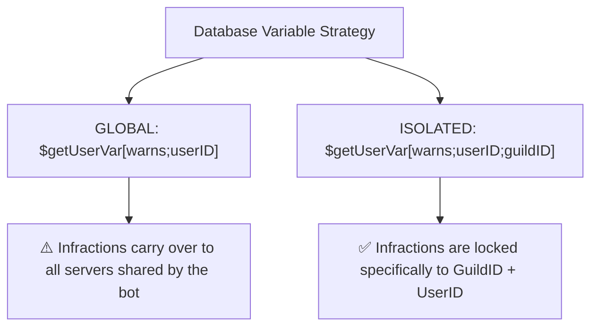

A robust **Warning (Warn) System** is a cornerstone of any professional Discord moderation bot. It allows server staff to issue formal warnings to misbehaving members, track their infractions, and take escalating disciplinary actions.

When building a warn system, one massive pitfall is database leakage: depending on your bot's user variable setting, `$getUserVar` without a `$guildID` may read a value shared by all servers, so a user warned on **Server A** would carry those warnings over to **Server B** (with the legacy setting, user variables are global unless you pass a guild ID; with the newer setting they are always stored per server and member).

To stay safe in both cases, `$getUserVar` and `$setUserVar` both accept an optional `Guild ID` parameter that **scopes the value to a specific UserID + GuildID pair**. In this guide, we will build a complete, highly secure, and professional warn suite!

---

## 🗄️ Database Scope: Preventing Cross-Server Leakage


```mermaid
graph TD
    A[Database Variable Strategy] --> B["GLOBAL: $getUserVar[warns;userID]"]
    A --> C["ISOLATED: $getUserVar[warns;userID;guildID]"]
    B --> D[⚠️ Infractions carry over to all servers shared by the bot]
    C --> E[✅ Infractions are locked specifically to GuildID + UserID]
```

By passing `$guildID` as the last argument (third for `$getUserVar`, fourth for `$setUserVar`), user data remains secure and isolated per server!

---

## 0. Prerequisite: Register the Database Variable

Before coding your scripts, register the warning variable in your Bot Creator dashboard:
* **Name**: `warns`
* **Default Value**: `0`

With a default of `0`, a member who was never warned reads `0`. Without a declared default, a value that was never written reads as an empty text.

---

## 1. The Warn Command (`!warn`)

Issues a warning to a member, increments their infraction counter, and sends a DM notification (with the reason) to the warned user, then posts a confirmation in the channel.

* **Trigger**: `!warn`
* **Code**:

```bdfd
$nomention
$onlyPerms[kickmembers;❌ You need the `Kick Members` permission to warn users!]

$var[target;$findUser[$message[1];no]]

$if[$var[target]==]
  ❌ Please specify a valid member to warn! 
  Usage: `!warn @user <reason>`
$else
  $if[$var[target]==$authorID]
    ❌ You cannot warn yourself!
  $else
    $var[reason;$message[>1]]
    $if[$var[reason]==]
      $var[reason;No reason provided by staff.]
    $endif

    $c[Retrieve, increment, and write back the infractions counter]
    $var[currentWarns;$getUserVar[warns;$var[target];$guildID]]
    $var[newWarns;$calculate[$var[currentWarns] + 1]]
    $setUserVar[warns;$var[newWarns];$var[target];$guildID]

    $c[Build the DM notification: $dm sends the message being built to that user]
    $dm[$var[target]]
    $title[⚠️ Infraction Notice]
    $color[#ef4444]
    $description[
    You have received a formal warning in **$serverName**.
    * **Reason**: $var[reason]
    * **Current Warnings**: `$var[newWarns]`
    ]

    $c[$useChannel sends the DM above, then the rest is sent as a normal channel message]
    $useChannel[$channelID]
    $title[🔨 Member Warned]
    $color[#ef4444]
    $thumbnail[$userAvatar[$var[target]]]
    $description[
    **$username[$var[target]]** has been successfully warned.
    ]
    $addField[Total Warns;`$var[newWarns]` warnings;yes]
    $addField[Reason;$var[reason];no]
    $footer[Moderator: $username]
    $footerIcon[$authorAvatar]
    $addTimestamp
  $endif
$endif
```

---

## 2. Listing Infractions (`!warns`)

Checks and displays the current warning count of a server member.

* **Trigger**: `!warns`
* **Code**:

```bdfd
$nomention
$var[target;$findUser[$message[1];yes]]

$var[infractions;$getUserVar[warns;$var[target];$guildID]]

$title[🗃️ Infraction Record]
$color[#3b82f6]
$thumbnail[$userAvatar[$var[target]]]

$var[alert;]
$if[$var[infractions]>=3]
  $var[alert;⚠️ **Alert**: This member has 3 or more warnings! Consider escalating disciplinary measures.]
$endif

$description[
Showing moderation infractions for **$username[$var[target]]** in this guild:

* **Active Infractions**: `$var[infractions]` formal warnings

$var[alert]
]

$footer[Queried by $username]
$footerIcon[$authorAvatar]
$addTimestamp
```

---

## 3. Removing One Warning (`!unwarn`)

Decrements a member's active warning count by `1`. Useful for resolving accidental warnings.

* **Trigger**: `!unwarn`
* **Code**:

```bdfd
$nomention
$onlyPerms[kickmembers;❌ You need the `Kick Members` permission to unwarn users!]

$var[target;$findUser[$message[1];no]]

$if[$var[target]==]
  ❌ Please specify a valid member! Usage: `!unwarn @user`
$else
  $var[currentWarns;$getUserVar[warns;$var[target];$guildID]]
  
  $if[$var[currentWarns]<=0]
    ❌ **$username[$var[target]]** has no active warnings to remove!
  $else
    $var[newWarns;$calculate[$var[currentWarns] - 1]]
    $setUserVar[warns;$var[newWarns];$var[target];$guildID]

    $title[✅ Infraction Removed]
    $color[#10b981]
    $description[
    Successfully removed one warning from **$username[$var[target]]**.
    * **Previous Warnings**: `$var[currentWarns]`
    * **New Total Warnings**: `$var[newWarns]`
    ]
    $footer[Actioned by: $username]
    $footerIcon[$authorAvatar]
    $addTimestamp
  $endif
$endif
```

---

## 4. Resetting All Warnings (`!clearwarns`)

Completely wipes clean a member's infraction record, resetting their warnings count to `0`.

* **Trigger**: `!clearwarns`
* **Code**:

```bdfd
$nomention
$onlyPerms[banmembers;❌ Only administrators or ban-capable staff can clear infraction histories!]

$var[target;$findUser[$message[1];no]]

$if[$var[target]==]
  ❌ Please specify a member! Usage: `!clearwarns @user`
$else
  $var[currentWarns;$getUserVar[warns;$var[target];$guildID]]

  $if[$var[currentWarns]<=0]
    ❌ **$username[$var[target]]** already has a clean infraction record!
  $else
    $setUserVar[warns;0;$var[target];$guildID]

    $title[🧹 Infraction History Cleared]
    $color[#6366f1]
    $description[
    Infraction records have been completely wiped clean for **$username[$var[target]]**.
    * **Cleared Warnings**: `$var[currentWarns]`
    * **New Status**: `0` warnings (Clean Record)
    ]
    $footer[Cleared by: $username]
    $footerIcon[$authorAvatar]
    $addTimestamp
  $endif
$endif
```
