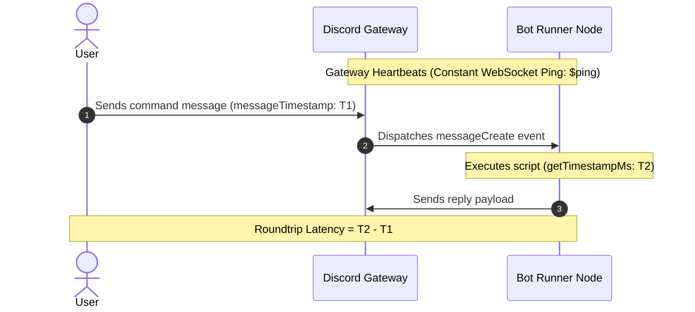

A `ping` command is the classic hello-world of Discord bots. While it seems simple on the surface, did you know that Discord bots have multiple types of latency? 

Most basic bots only display a static connection latency. However, a professional bot should provide deep diagnostic details, separating the internal gateway connection speed from the actual, user-perceived message roundtrip speed.

This guide walks you through building the ultimate, highly informative `/ping` (or `!ping`) command using Bot Designer for Discord (BDFD) / Bot Creator.

---

## 📊 The Two Core Latencies Explained

When measuring how fast your Discord bot is performing, you must look at two distinct metrics:

| Metric Type | What It Measures | Standard Variable / Formula |
| :--- | :--- | :--- |
| **Gateway / WebSocket Latency** | The heartbeat connection speed between your bot's runner node and Discord's Gateway server. | `$ping` (or `((bot.ping))`) |
| **User-Perceived Roundtrip Latency** | The total real-world time it takes for a user's message to reach Discord, trigger the bot, and for the bot's response to be fully sent back. | `$calculate[$getTimestampMs - $messageTimestamp]` |

---

## 1. Gateway Latency (`$ping`)

The native `$ping` function (also available in Bot Creator templates as `((bot.ping))` or `((ping))`) retrieves the **WebSocket heartbeat latency** in milliseconds. This is calculated automatically by the bot engine.

### Syntax
```bdfd
$ping
```

* **Output**: Returns the latency number directly (e.g., `42`), representing the time in milliseconds.

---

## 2. Dynamic Message Roundtrip Latency

To calculate the absolute roundtrip speed, we can subtract the timestamp of when the command message was sent from the current execution time. 

Bot Creator provides two extremely high-resolution variables to make this math possible:
1. `$getTimestampMs` (resolves to the current system millisecond epoch).
2. `$messageTimestamp` (resolves to the message creation millisecond epoch).

By nesting these in the `$calculate` function, we obtain a precise, real-time roundtrip delay:

### Formula
```bdfd
$calculate[$getTimestampMs - $messageTimestamp]
```

* **Output**: The exact number of milliseconds elapsed since the message was dispatched by the user and processed by your bot's execution thread.

---

## 3. Visual Flow of Latencies

Here is exactly how both latencies are measured under the hood:



---

## 4. The Complete Production Script

Below is a highly polished, aesthetic, copy-pasteable script to create your ping command. It features a modern, clean embed layout with responsive color coding based on response times!

### Command Structure
* **Trigger**: `ping` or `!ping` (or set as a Slash Command)
* **Code**:

```bdfd
$title[🏓 Pong!]
$color[#3b82f6]
$thumbnail[$userAvatar[$botID]]

$description[
📊 **Bot Latency Diagnostics**
Here is a detailed breakdown of current system responsiveness:
]

$addField[WebSocket Ping;⚡ `$ping ms` (Gateway Heartbeat);true]
$addField[API Roundtrip;⌛ `$calculate[$getTimestampMs - $messageTimestamp] ms` (Real-world response);true]

$footer[Requested by $username; $authorAvatar]
$addTimestamp
```

### Pro-Tip: Color-Coded Responsiveness
If you want to go a step further and change the embed's color dynamically depending on the speed of the connection, you can leverage `$if` checks:

```bdfd
$var[roundtrip;$calculate[$getTimestampMs - $messageTimestamp]]

$title[🏓 Pong!]
$thumbnail[$userAvatar[$botID]]

$description[
📊 **System Diagnostic Report**
]

$addField[WebSocket Latency;⚡ `$ping ms`;true]
$addField[API Latency;⌛ `$var[roundtrip] ms`;true]

$if[$var[roundtrip]<150]
  $color[#10b981]  // Green for excellent speeds
  $description[$description[]🟢 Connection quality is **excellent**!]
$else
  $if[$var[roundtrip]<300]
    $color[#f59e0b]  // Yellow/Orange for average speed
    $description[$description[]🟡 Connection is stable, but experiencing minor delay.]
  $else
    $color[#ef4444]  // Red for high latency
    $description[$description[]🔴 High delay detected. Discord or the bot runner might be under heavy load.]
  $endif
$endif

$footer[Diagnostics complete; $authorAvatar]
$addTimestamp
```

---

## 🛠️ Troubleshooting & Best Practices

* **Always use `$getTimestampMs` for calculations**: Avoid standard `$getTimestamp` which only returns seconds, rendering millisecond calculations impossible.
* **Slash Command compatibility**: When using Slash Commands, `$messageTimestamp` is fully supported as Bot Creator automatically populates the interaction event trigger context.
* **Negative numbers?**: In rare scenarios, if system clocks are slightly out-of-sync or if message updates occur out of sequence, the calculation might yield a small negative or abnormally high value. Implementing a `$if[$var[roundtrip]<0]` handler to fallback to `0 ms` is a safe production practice.
