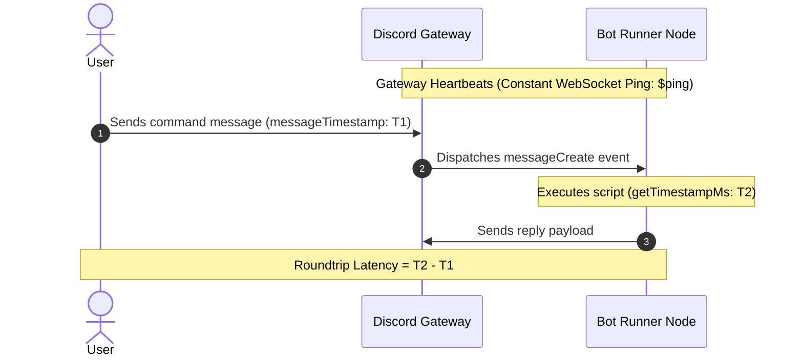

A `ping` command is the classic hello-world of Discord bots. While it seems simple on the surface, did you know that Discord bots have multiple types of latency? 

Most basic bots only display a static connection latency. However, a professional bot should provide deep diagnostic details, separating the internal gateway connection speed from the actual, user-perceived message roundtrip speed.

This guide walks you through building the ultimate, highly informative `!ping` command using Bot Designer for Discord (BDFD) / Bot Creator.

---

## 📊 The Two Core Latencies Explained

When measuring how fast your Discord bot is performing, you must look at two distinct metrics:

| Metric Type | What It Measures | Standard Variable / Formula |
| :--- | :--- | :--- |
| **Gateway / WebSocket Latency** | The heartbeat connection speed between your bot's runner node and Discord's Gateway server. | `$ping` (or `((bot.ping))`) |
| **User-Perceived Roundtrip Latency** | The time elapsed between the creation of the user's message and the moment your script runs (the response itself is not included). | `$calculate[$getTimestampMs - $messageTimestamp]` |

---

## 1. Gateway Latency (`$ping`)

The native `$ping` function (also available in Bot Creator templates as `((bot.ping))` or `((ping))`) retrieves the **WebSocket heartbeat latency** in milliseconds. The engine reads it from the bot's gateway connection; it returns `0` when no latency is available.

### Syntax
```bdfd
$ping
```

* **Output**: Returns the latency number directly (e.g., `42`), representing the time in milliseconds.

---

## 2. Dynamic Message Roundtrip Latency

To calculate the absolute roundtrip speed, we can subtract the timestamp of when the command message was sent from the current execution time. 

Bot Creator provides two functions to make this math possible:
1. `$getTimestampMs` (resolves to the current millisecond epoch).
2. `$messageTimestamp` (with no argument, resolves to the creation time of the message that triggered the command, as a millisecond epoch; it is only filled in for commands triggered by a message).

By nesting these in the `$calculate` function, we obtain a precise, real-time roundtrip delay:

### Formula
```bdfd
$calculate[$getTimestampMs - $messageTimestamp]
```

* **Output**: The number of milliseconds elapsed between the creation of the message and the moment this part of the script runs.

---

## 3. Visual Flow of Latencies

Here is exactly how both latencies are measured under the hood:


```mermaid
sequenceDiagram
    autonumber
    actor User as User
    participant Discord as Discord Gateway
    participant Runner as Bot Runner Node

    Note over Discord, Runner: Gateway Heartbeats (Constant WebSocket Ping: $ping)
    User->>Discord: Sends command message (messageTimestamp: T1)
    Discord->>Runner: Dispatches messageCreate event
    Note over Runner: Executes script (getTimestampMs: T2)
    Runner->>Discord: Sends reply payload
    Note over User, Runner: Roundtrip Latency = T2 - T1
```

---

## 4. The Complete Production Script

Below is a highly polished, aesthetic, copy-pasteable script to create your ping command. It features a modern, clean embed layout with responsive color coding based on response times!

### Command Structure
* **Trigger**: `!ping` (a command triggered by a message)
* **Code**:

```bdfd
$title[🏓 Pong!]
$color[#3b82f6]
$thumbnail[$userAvatar[$botID]]

$description[
📊 **Bot Latency Diagnostics**
Here is a detailed breakdown of current system responsiveness:
]

$addField[WebSocket Ping;⚡ `$ping ms` (Gateway Heartbeat);true]
$addField[API Roundtrip;⌛ `$calculate[$getTimestampMs - $messageTimestamp] ms` (Real-world response);true]

$footer[Requested by $username]
$footerIcon[$authorAvatar]
$addTimestamp
```

### Pro-Tip: Color-Coded Responsiveness
If you want to go a step further and change the embed's color dynamically depending on the speed of the connection, you can leverage `$if` checks:

```bdfd
$var[roundtrip;$calculate[$getTimestampMs - $messageTimestamp]]

$if[$var[roundtrip]<150]
  $c[Green for excellent speeds]
  $color[#10b981]
  $var[verdict;🟢 Connection quality is **excellent**!]
$else
  $if[$var[roundtrip]<300]
    $c[Yellow/Orange for average speed]
    $color[#f59e0b]
    $var[verdict;🟡 Connection is stable, but experiencing minor delay.]
  $else
    $c[Red for high latency]
    $color[#ef4444]
    $var[verdict;🔴 High delay detected. Discord or the bot runner might be under heavy load.]
  $endif
$endif

$title[🏓 Pong!]
$thumbnail[$userAvatar[$botID]]

$description[
📊 **System Diagnostic Report**
$var[verdict]
]

$addField[WebSocket Latency;⚡ `$ping ms`;yes]
$addField[API Latency;⌛ `$var[roundtrip] ms`;yes]

$footer[Diagnostics complete]
$footerIcon[$authorAvatar]
$addTimestamp
```

---

## 🛠️ Troubleshooting & Best Practices

* **Keep the units equal**: `$getTimestamp` returns seconds by default, while `$messageTimestamp` is in milliseconds. Use `$getTimestampMs` (or `$getTimestamp[ms]`) so both sides of the subtraction use milliseconds.
* **Slash commands**: `$messageTimestamp` reads the `message.timestamp` value, which is filled in for commands triggered by a message. Do not rely on it in a slash command.
* **Negative numbers?**: If system clocks are slightly out-of-sync, the calculation might yield a small negative or abnormally high value. Implementing a `$if[$var[roundtrip]<0]` handler to fallback to `0 ms` is a safe production practice.
